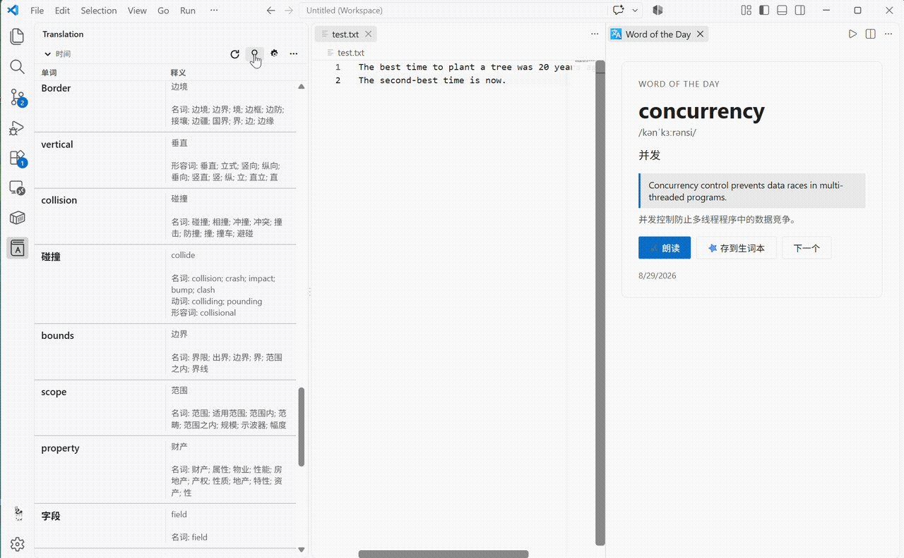
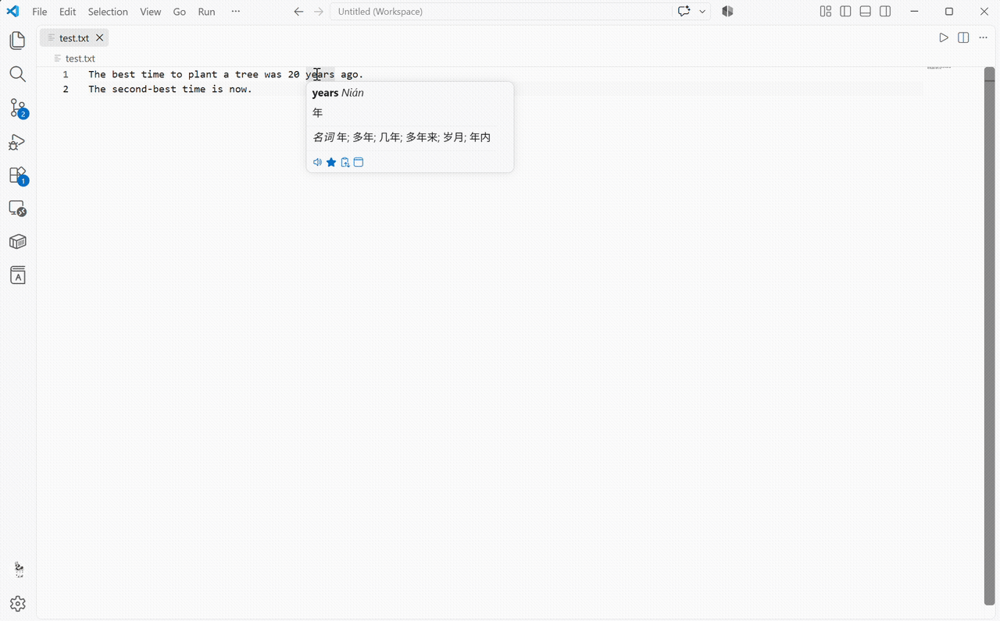
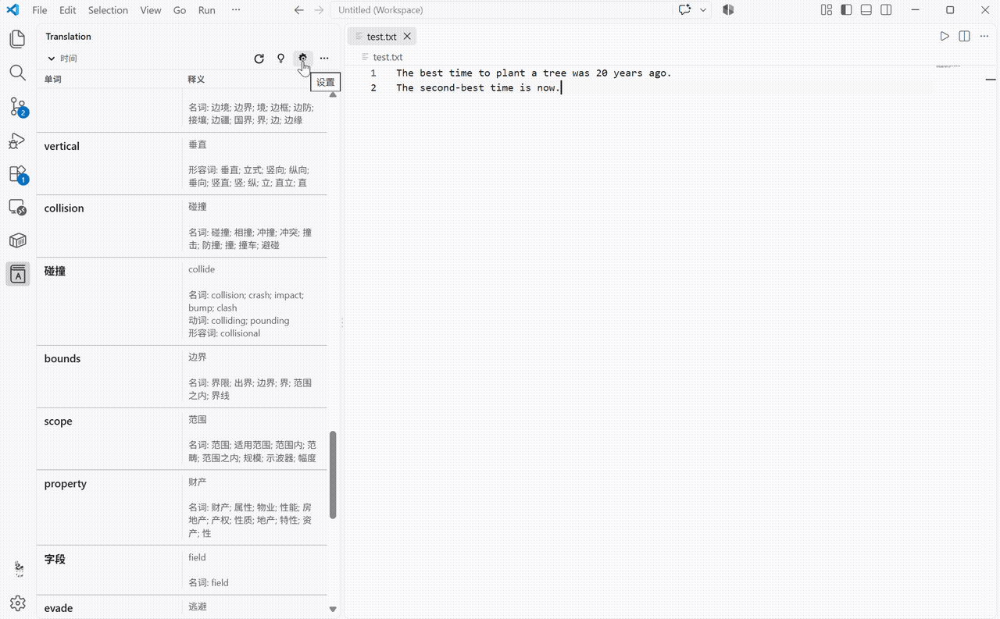
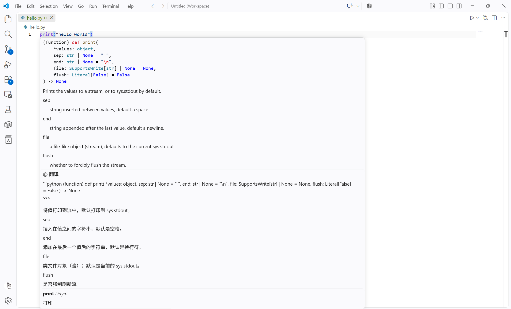

# Translation

Visual Studio Code 翻译插件。支持多翻译引擎、多语言互译、TTS 朗读、翻译弹窗、生词本、悬停翻译等。

## 演示

| 功能 | 演示 |
|------|------|
| 翻译弹窗 |  |
| 悬停翻译 |  |
| 每日一词 |  |
| 单词搜索 |  |
| 函数文档翻译 |  |

## 功能

- **多翻译引擎**
  - Microsoft Translator(Bing 免费接口,无需 API Key)
  - Google Translate(免费接口,无需 API Key)
  - OpenAI 兼容接口(OpenAI / DeepSeek / 任意兼容服务,需 API Key)
- **多语言互译**,支持自动检测源语言
- **文本转语音(TTS)**
  - Microsoft Edge TTS(免费)
  - OpenAI TTS(需 API Key)
- **翻译弹窗**(Webview):语言切换、朗读、复制、加入生词本、历史记录
- **替换为译文**:支持 camelCase / snake_case / PascalCase / kebab-case / 原文
- **悬停翻译**(可配置开关与延迟)
- **文档翻译 & 注释翻译**
- **生词本**(侧边栏视图,像原插件的工具窗口):朗读/复制/删除
- **每日一词**
- **状态栏引擎指示器**,点击快速切换引擎

## 使用

| 操作 | 快捷键(Windows) | 快捷键(macOS) |
|------|----------------|--------------|
| 翻译弹窗 | `Ctrl+Shift+O` | `Cmd+Ctrl+I` |
| 翻译选中文本/单词 | `Ctrl+Shift+Y` | `Cmd+Ctrl+U` |
| 替换为译文 | `Ctrl+Shift+X` | `Cmd+Ctrl+O` |
| 切换引擎 | `Ctrl+Shift+S` | `Cmd+Ctrl+Y` |

或在编辑器右键菜单中选择「翻译」「替换为译文」「Show Translation Dialog...」。

- **翻译**:选中文本后翻译;未选中时自动取光标所在单词(支持 camelCase 拆分)。
- **替换为译文**:将译文按命名风格替换回编辑器;目标语言为英文时,插件会同时给出 camelCase / 风格化 / 原文三种格式供选择。
- **TTS**:在翻译弹窗中点「朗读」,或对选中的文本运行 `Translation: Text to Speech`。
- **悬停翻译**:鼠标悬停在单词上即可看到译文(可在设置中关闭)。

## 配置

在 `Settings` 中搜索 `translation` 打开本插件配置页:

| 配置项 | 说明 | 默认 |
|--------|------|------|
| `translation.defaultEngine` | 默认翻译引擎 | `microsoft` |
| `translation.sourceLanguage` | 源语言(`auto` 自动检测) | `auto` |
| `translation.targetLanguage` | 目标语言 | `zh-CN` |
| `translation.replaceSeparator` | 替换为译文时的命名风格 | `original` |
| `translation.hover.enabled` / `delay` | 悬停翻译开关 / 延迟(ms) | `true` / `300` |
| `translation.ttsEngine` | TTS 引擎(`edge` / `openai`) | `edge` |
| `translation.tts.edge.voice` / `speed` | Edge TTS 音色 / 语速 | 自动 / `0%` |
| `translation.tts.openai.voice` | OpenAI TTS 音色 | `alloy` |
| `translation.openai.baseUrl` | OpenAI 兼容接口地址 | `https://api.openai.com` |
| `translation.openai.model` | 翻译所用模型 | `gpt-4o-mini` |
| `translation.history.maxEntries` | 历史记录条数上限 | `100` |

### API Key

运行命令 **`Translation: Open Settings`** 可配置 API Key(通过系统密钥库保存,不会写入文件)。OpenAI 兼容引擎需要 API Key。

### 使用 DeepSeek 作为翻译引擎

`translation.openai.baseUrl` 设为 `https://api.deepseek.com`,`translation.openai.model` 设为 `deepseek-chat`,然后在 `Translation: Open Settings` 中填入 DeepSeek API Key 即可。

## 翻译引擎说明

| 引擎 | 是否需要 Key | 说明 |
|------|:-----------:|------|
| Microsoft Translator | 否 | 使用 Bing Translate 免费接口(微软翻译服务) |
| Google Translate | 否 | 使用 translate.google.com 免费接口 |
| OpenAI 兼容 | 是 | OpenAI / DeepSeek / Azure OpenAI 等兼容服务 |

## 生词本与 IntelliJ 插件互通

本插件的生词本与 [IntelliJ TranslationPlugin](https://github.com/YiiGuxing/TranslationPlugin) **共用同一个 SQLite 数据库**(`wordbook.sqlite`),两边保存的单词互相可见。

- **默认数据库位置**:
  - Windows:`%LOCALAPPDATA%\Yii.Guxing\TranslationPlugin\wordbook.sqlite`
  - macOS/Linux:`$XDG_DATA_HOME/Yii.Guxing/TranslationPlugin/wordbook.sqlite` 或 `~/.TranslationPlugin/wordbook.sqlite`
- **打开方式**:点击左侧活动栏的 **Translation** 图标(类似原插件的工具窗口);或在命令面板运行 `Translation: Word Book`。
- **操作**:每个词条支持 朗读 / 复制译文 / 删除(右键菜单)。
- **自定义位置**:如需指向其它数据库文件/目录,设置 `translation.wordbook.path`。

## 已知限制

- Google 翻译免费接口可能受网络环境/地区影响;如不可用请切换到 Microsoft 或 OpenAI 引擎。
- Edge TTS 与 Google 翻译依赖对相应域名的网络连通性。

## License

MIT
